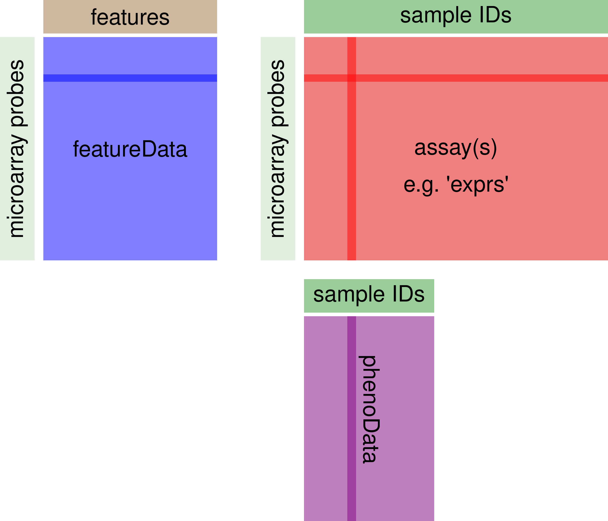

```{r setup, include=FALSE}
knitr::opts_chunk$set(echo = TRUE)
```

## 1. Introduction

Differential gene expression (DGE) analysis of Affymetrix microarrays of cardiac neural crest cells using Klaus B, Reisenauer S (2019). maEndToEnd: [An end to end workflow for differential gene expression using Affymetrix microarrays.](https://bioconductor.riken.jp/packages/3.9/workflows/html/maEndToEnd.html) Bioconductor workflow.

All text below correspond to the above workflow and only small changes were made to adapt it to the dataset used for the main pruporse of this Rmarkdown document (analyzing E10.5 cardiac neural crest cells microaaray data from Dai et al. 2012 [*E-GEOD-41179*] ~~and cardiac outflow tract cells from Robrini et al., 2015 [*E-GEOD-64556*]~~)

```{r main-package, include=FALSE}

if (!require("BiocManager"))
    install.packages("BiocManager")
BiocManager::install("maEndToEnd")
```

```{r main-package-import, include=TRUE}
suppressPackageStartupMessages({library("maEndToEnd")})
```
Load necessary packages for subsequent analysis
```{r other-packages, include=TRUE}

#General Bioconductor packages
    library(Biobase)
    library(oligoClasses)
     
#Annotation and data import packages
    library(ArrayExpress)
    library(pd.hugene.1.0.st.v1)
    library(hugene10sttranscriptcluster.db)
     
#Quality control and pre-processing packages
    library(oligo)
    library(arrayQualityMetrics)
     
#Analysis and statistics packages
    library(limma)
    library(topGO)
    library(ReactomePA)
    library(clusterProfiler)
     
#Plotting and color options packages
    library(gplots)
    library(ggplot2)
    library(geneplotter)
    library(RColorBrewer)
    library(pheatmap)
    library(enrichplot)
     
#Formatting/documentation packages
   #library(rmarkdown)
   #library(BiocStyle)
    library(dplyr)
    library(tidyr)

#Helpers:
    library(stringr)
    library(matrixStats)
    library(genefilter)
    library(openxlsx)

```

## 2. Downloading raw data from ArrayExpress

The first step of the analysis is to download the raw data CEL files. These files are produced by the array scanner software and contain the measured probe intensities.

For this analysis on cardiac neural crest cells, I will use the data deposited with study **E-GEOD-41179**.

```{r raw-data-check, echo=TRUE}

raw_data_dir <- tempdir()

if (!dir.exists(raw_data_dir)) {
    dir.create(raw_data_dir)
}
```

Each ArrayExpress data set has a landing page summarizing the data set, and we use the `getAE` function from the ArrayExpress Bioconductor package to obtain the ftp links to the raw data files (Data from Dai X, Jiang W, Zhang Q, Xu L et al. Requirement for integrin-linked kinase in neural crest migration and differentiation and outflow tract morphogenesis. BMC Biol 2013 Oct 16;11:107. PMID: 24131868). With the code below, we download the raw data (also including annotation data) from ArrayExpress (2) by using the `getAE`-function. The data are saved in the raw_data_dir created above. The names of the downloaded files are returned as a list."

```{r raw-data-import, include=TRUE}

anno_AE <- getAE("E-GEOD-41179", path = raw_data_dir, type = "raw")
```

## 3. Background information on the data

Each dataset in ArrayExpress is stored following MAGE-TAB (MicroArray Gene Expression Tabular) specifications:

-   Investigation Description Format (IDF): contains top level information about the experiment including title, description, submitter contact details and protocols
-   Array Design Format (ADF)
-   Sample and Data Relationship Format (SDRF): contains essential information on the experimental samples, e.g. the experimental group(s) they belong to.
-   Raw data files
-   Processed data files

Before we move on to the actual raw data import, we will briefly introduce the `ExpressionSet` class contained in the `Biobase` package. It is commonly used to store microarray data in Bioconductor.

## 4. Bioconductor ExpressionSets

Genomic data can be very complex, usually consisting of a number of different components, e.g. information on the experimental samples, annotation of genomic features measured as well as the experimental data itself. In Bioconductor, the approach is taken that these components should be stored in a single structure to easily manage the data.

The package `Biobase` contains standardized data structures to represent genomic data. The `ExpressionSet` class is designed to combine several different sources of information (i.e. as contained in the various MAGE-TAB files) into a single convenient structure. An `ExpressionSet` can be manipulated (e.g., subsetted, copied), and is the input to or output of many Bioconductor functions.

The data in an `ExpressionSet` consist of:

-   assayData: Expression data from microarray experiments with microarray probes in rows and sample identifiers in - columns
-   metaData
-   phenoData: A description of the samples in the experiment with sample identifiers in rows and description elements in columns; holds the content of the SDRF file
-   featureData: metadata about the features on the chip or technology used for the experiment with same rows as assayData by default and freely assignable columns
-   further annotations for the features, for example gene annotations from biomedical databases (annotation). experimentData: A flexible structure to describe the experiment.

The ExpressionSet class coordinates all of these data, so that one does not have to worry about the details. However, one should keep in mind that the rownames of the phenoData have to match the column names of the assay data, while the row names of the assay data have to match the row names of the featureData. This is illustrated in Figure 1.

{width = 60%}

You can use the functions `pData` and `fData` to extract the sample and feature annotation, respectively, from an ExpressionSet. The function `exprs` will return the expression data itself as a matrix.

## 5. Import of annotation data and microarray expression data as "ExpressionSet"

We import the SDRF file with the `read.delim` function from the raw data folder in order to obtain the sample annotation.

The sample names are given in the column Array.Data.File of the SDRF data table and will be used as rownames for the SDRF file.

We turn the SDRF table into an `AnnotatedDataFrame` from the `Biobase` package that we will need later to create an `ExpressionSet` for our data (3).

```{r SDRF, include=TRUE}

sdrf_location <- file.path(raw_data_dir, anno_AE$sdrf)
SDRF <- read.delim(sdrf_location)

rownames(SDRF) <- SDRF$Array.Data.File
SDRF <- AnnotatedDataFrame(SDRF)

```

We now create the Expression Set object `raw_data`, which contains array data, pheno data (from the SDRF file) as well as the information of the chip annotation package used.

The analysis of Affymetrix arrays starts with CEL files. These are the result of the processing of the raw image files using the Affymetrix software and contain estimated probe intensity values. Each CEL file additionally contains some metadata, such as a chip identifier.

We use the function `read.celfiles` from the `oligo` package (4) to import the files:

```{r read-cel-files, include=TRUE}

raw_data <- oligo::read.celfiles(filenames = file.path(raw_data_dir, 
                                                SDRF$Array.Data.File),
                                    verbose = FALSE, phenoData = SDRF)
stopifnot(validObject(raw_data))
```

This automatically creates an ExpressionSet, fills the sections "array data" with the data from the CEL files and uses the correct chip annotation package, in this case *pd.hugene.1.0.st.v1* (the chip-type is also stored in the .CEL files).

Furthermore, we specified our `AnnotatedDataFrame` "SDRF" created earlier from the SDRF file as `phenoData`. Thus, we had to make sure to import the CEL files in the order that corresponds to the SDRF table --- to enforce this, we used the column `Array.Data.File` of the `SDRF` table as the `filenames` argument.

Finally, we checked whether the object created is valid (e.g. sample names match between the different tables).

We now have a first look on the raw data.

The `pData` function of the `Biobase` package directly accesses the `phenoData` in the ExpressionSet `raw_data`. With the `head()` function, we can view the first six lines of the table. We have a look at the columns included and retain only those columns that are related to the experimental factors of interest.

```{r}
head(Biobase::pData(raw_data))
```

The columns of interest for us are the following:

-   identifiers of the subjects/samples: i.e. columns "Source.Name", "Comment..Sample_title."
-   condition/disease of the subjects/samples: i.e. "Characteristics..variation."
-   genotype: i.e. "Comment..Sample_source_name."

We now subselect the corresponding columns:

```{r data-subselection, include=TRUE}
Biobase::pData(raw_data) <- Biobase::pData(raw_data)[, c("Source.Name",
                                     "Comment..Sample_title.",
                                     "Characteristics..variation.",
                                     "Comment..Sample_source_name.")]
```

## 6. Quality control of the raw data

The first step after the initial data import is the quality control of the data. Here we check for outliers and try to see whether the data clusters as expected, e.g. by the experimental conditions. The expression intensity values are in the assayData sub-object `exprs` and can be accessed by the `exprs(raw_data)` function. The rows represent the microarray probes, i.e. the single DNA locations on the chip, while the columns represent one microarray, i.e. a sample of inflamed and non-inflamed tissue of every patient, respectively.

```{r expression-data-01, include=TRUE}
# Checkin the expression data of the first 10 probes from the 4 exp samples.
Biobase::exprs(raw_data)[1:10, 1:4]
```

For quality control, we take the log2 of `Biobase::exprs(raw_data)`, as expression data is commonly analyzed on a logarithmic scale. We then perform a principal component analysis (PCA) and plot it (Figure 2). Every point in the plot represents one sample, with the colour indicating phenotype and condition.

```{r expression-data-02, include=TRUE}
exp_raw <- log2(Biobase::exprs(raw_data))
PCA_raw <- prcomp(t(exp_raw), scale. = FALSE)

percentVar <- round(100*PCA_raw$sdev^2/sum(PCA_raw$sdev^2),1)
sd_ratio <- sqrt(percentVar[2] / percentVar[1])

dataGG <- data.frame(PC1 = PCA_raw$x[,1], PC2 = PCA_raw$x[,2],
                    Condition = pData(raw_data)$Characteristics..variation.,
                    Phenotype = pData(raw_data)$Comment..Sample_source_name.,
                    Individual = pData(raw_data)$Comment..Sample_title.)

ggplot(dataGG, aes(PC1, PC2)) +
      geom_point(aes(shape = Condition, colour = Phenotype)) +
  ggtitle("PCA plot of the log-transformed raw expression data") +
  xlab(paste0("PC1, VarExp: ", percentVar[1], "%")) +
  ylab(paste0("PC2, VarExp: ", percentVar[2], "%")) +
  theme(plot.title = element_text(hjust = 0.5))+
  coord_fixed(ratio = sd_ratio) +
  scale_shape_manual(values = c(4,15)) + 
  scale_color_manual(values = c("darkorange2", "dodgerblue4"))
```

We also represent the probe intensities via a boxplot graph with one box per individual microarray. (Figure 3). Note that the `oligo::boxplot` function, i.e. the boxplot function of the `oligo` package, can take expression sets as argument. It accesses the expression data and performs a log2-transformation by default. We therefore can use `raw_data` as argument here.

```{r expression-data-03, include=TRUE}
oligo::boxplot(raw_data, target = "core", 
               main = "Boxplot of log2-intensitites for the raw data")
```

When looking at the boxplot (Figure 3), we see that the intensity distributions of the individual arrays are quite different, indicating the need for an appropriate normalization, which we will discuss next.

Until now, we have only performed a very basic quality control; more elaborate quality control plots are available in the package arrayQualityMetrics (5). The package produces an html report, containing the quality control plots together with a description of their aims and an identification of possible outliers. We do not discuss this tool in detail here, but simply provide the code below, which creates a report for our raw data.

```{r expression-data-04, include=TRUE}
arrayQualityMetrics(expressionset = raw_data,
    outdir = tempdir(),
    force = TRUE, do.logtransform = TRUE,
    intgroup = c("Characteristics..variation.", "Comment..Sample_source_name."))
```
## 7. Background adjustment, calibration, summarization and annotation

### 7.1 Background adjustment

After the initial import and quality assessment, the next step in processing of microarray data is background adjustment. This is essential because a proportion of the measured probe intensities are due to non-specific hybridization and the noise in the optical detection system. Therefore, observed intensities need to be adjusted to give accurate measurements of specific hybridization.

### 7.2 Across-array normalization (calibration)

Normalization across arrays is needed in order to be able to compare measurements from different array hybridizations due to many obscuring sources of variation. These include different efficiencies of reverse transcription, labeling or hybridization reactions, physical problems with the arrays, reagent batch effects, and laboratory conditions.

### 7.3 Summarization

After normalization, summarization is necessary to be done because on the Affymetrix platform, transcripts are represented by multiple probes, that is multiple locations on the array. For each gene, the background-adjusted and normalized intensities of all probes need to be summarized into one quantity that estimates an amount proportional to the amount of RNA transcript.

After the summarization step, the summarized data can be annotated with various information, e.g. gene symbols and ENSEMBL gene identifiers. There is an annotation database available from Bioconductor for our platform, namely the package *hugene10sttranscriptcluster.db*.

### 7.5 One-step preprocessing in oligo

The package oligo allows us to perform background correction, normalization and summarization in one single step using a deconvolution method for background correction, quantile normalization and the RMA (robust multichip average) algorithm for summarization.

This series of steps as a whole is commonly referred to as RMA algorithm, although strictly speaking RMA is merely a summarization method (6–8).

## 8. Relative Log Expression data quality analysis

Before calibrating and evaluating the data, we want to perform another quality control procedure, namely Relative Log Expression (RLE), as described in the article by Gandolfo et al (9). To this end, we first perform an RMA without prior normalization:

```{r expression-data-05, include=TRUE}
dai2012 <- oligo::rma(raw_data,
                      #target = "core",
                      normalize = FALSE)
```

### 8.1 Computing the RLE

The RLE is performed by calculating the median log2 intensity of every transcript across all arrays.

We do this by calculating the row medians of exprs(palmieri_eset), as the transcripts are represented by the rows and the single microarrays by the columns.

Note that we do not have to apply the log2 manually, as the output data of the RMA function is in log2 scale by default.

We then substract this transcript median intensity from every transcript intensity via the sweep function.

### 8.2 Plotting RLE

We finally reshape the data into a format in which we can use to create a boxplot for each array, as before:

```{r rle, include=TRUE}
row_medians_assayData <- 
  Biobase::rowMedians(as.matrix(Biobase::exprs(dai2012)))

RLE_data <- sweep(Biobase::exprs(dai2012), 1, row_medians_assayData)

RLE_data <- as.data.frame(RLE_data)
RLE_data_gathered <- 
  tidyr::gather(RLE_data, patient_array, log2_expression_deviation)

ggplot2::ggplot(RLE_data_gathered, aes(patient_array,
                                       log2_expression_deviation)) + 
  geom_boxplot(outlier.shape = NA) + 
  ylim(c(-2, 2)) + 
  theme(axis.text.x = element_text(colour = "aquamarine4", 
                                  angle = 60, size = 6.5, hjust = 1 ,
                                  face = "bold"))
```
Note that the y-axis now displays for each microarray the deviation of expression intensity from the median expression of the respective single transcripts across arrays.

Boxes with a larger extension therefore indicate an unusually high deviation from the median in a lot of transcripts, suggesting that these arrays are different from most of the others in some way.

Boxes that are shifted in y-direction indicate a systematically higher or lower expression of the majority of transcripts in comparison to most of the other arrays. This could be caused by quality issues or batch effects.

Therefore, if shape and median of a given box varies too much from the bulk, they should be inspected and potentially removed.

## 9. Calibration of the data
Now, we can apply the full RMA algorithm to our data in order to background-correct, normalize and summarize:

```{r rma, include=TRUE}
dai2012_norm <- oligo::rma(raw_data)
```

### 9.2 Quality assessment of normalized data

```{r norm-data-quality,include=TRUE}
exp_dai2012 <- Biobase::exprs(dai2012_norm)
PCA <- prcomp(t(exp_dai2012), scale = FALSE)

percentVar <- round(100*PCA$sdev^2/sum(PCA$sdev^2),1)
sd_ratio <- sqrt(percentVar[2] / percentVar[1])

dataGG <- data.frame(PC1 = PCA$x[,1], PC2 = PCA$x[,2],
                    Condition = 
                     Biobase::pData(dai2012_norm)$Characteristics..variation.,
                    Phenotype = 
                     Biobase::pData(dai2012_norm)$Comment..Sample_source_name.)


ggplot(dataGG, aes(PC1, PC2)) +
      geom_point(aes(shape = Condition, colour = Phenotype)) +
  ggtitle("PCA plot of the calibrated, summarized data") +
  xlab(paste0("PC1, VarExp: ", percentVar[1], "%")) +
  ylab(paste0("maEndtoEnd-Fig1.pngC2, VarExp: ", percentVar[2], "%")) +
  theme(plot.title = element_text(hjust = 0.5)) +
  coord_fixed(ratio = sd_ratio) +
  scale_shape_manual(values = c(4,15)) + 
  scale_color_manual(values = c("darkorange2", "dodgerblue4"))
```

## 10. Filtering based on intensity

```{r filtering-01, include=TRUE}
dai2012_medians <- rowMedians(Biobase::exprs(dai2012_norm))

hist_res <- hist(dai2012_medians, 100, col = "cornsilk1", freq = FALSE, 
            main = "Histogram of the median intensities", 
            border = "antiquewhite4",
            xlab = "Median intensities")
```
In the histogram of the gene-wise medians (Figure 8), we can clearly see an enrichment of low medians on the left hand side. These represent the genes we want to filter. In order to infer a cutoff from the data, we inspect the histogram: We visually set a cutoff line man_threshold to the left of the histogram peak in order not to exclude too many genes. In our example, we choose a threshold of 4. We plot the same histogram as before and add the threshold line with the abline() function:

```{r filtering-02, include=TRUE}
man_threshold <- 3.5

hist_res <- hist(dai2012_medians, 100, col = "cornsilk", freq = FALSE, 
            main = "Histogram of the median intensities",
            border = "antiquewhite4",
            xlab = "Median intensities")

abline(v = man_threshold, col = "coral4", lwd = 2)
```
Transcripts that do not have intensities larger than the threshold in at least as many arrays as the smallest experimental group are excluded.

In order to do so, we first have to get a list with the number of samples (=arrays) (no_of_samples) in the experimental groups:

```{r filtering-03, include=TRUE}
no_of_samples <- 
  table(paste0(pData(dai2012_norm)$Characteristics..variation., "_", 
                  pData(dai2012_norm)$Comment..Sample_source_name.))
no_of_samples 
```
We now filter out all transcripts that do not have intensities greater than the threshold in at least as many arrays as the smallest experimental group (14) which we define as `samples_cutoff`.

A function `idx_man_threshold` is then applied to each row, i.e.  to each transcript across all arrays. It evaluates whether the number of arrays where the median intensity passes the threshold (`sum(x > man_threshold)`) is greater than the `samples_cutoff` and returns `TRUE` or `FALSE` for each row, i.e. each transcript.

We then create a table of `idx_man_threshold` to summarize the results and get an overview over how many genes are filtered out. In the last step, we subset our expression set to `dai2012_manfiltered` and keep the `TRUE` elements of `idx_man_threshold`.

```{r filtering-04.1, include=TRUE}
samples_cutoff <- min(no_of_samples)

idx_man_threshold <- apply(Biobase::exprs(dai2012_norm), 1,
                           function(x){
                          sum(x > man_threshold) >= samples_cutoff})
                          table(idx_man_threshold)
```

```{r filtering-04.2, include=TRUE}
dai2012_manfiltered <- subset(dai2012_norm, idx_man_threshold)
```

## 11. Annotation of the transcript clusters

Before we continue with the linear models for microarrays and differential expression, we first add “feature data”, i.e. annotation information to the transcript cluster identifiers stored in the featureData of our `ExpressionSet`:

> Important note: Dai 2012 uses `pd.mouse430.2` and therfore we will need to install/load the respective mouse databse

```{r mouse-db, include=TRUE}
# library(pd.mouse430.2)
# head(ls("package:pd.mouse430.2"))

if(!require("mouse4302.db"))
   BiocManager::install("mouse4302.db")

library(mouse4302.db)

head(ls("package:mouse4302.db"))
```


```{r annotation-01, include=TRUE}
anno_dai2012 <- AnnotationDbi::select(mouse4302.db,
                                  keys = (featureNames(dai2012_manfiltered)),
                                  columns = c("SYMBOL", "GENENAME"),
                                  keytype = "PROBEID")

#anno_dai2012 <- subset(anno_dai2012, !is.na(SYMBOL))
```
We used the function select from `AnnotationDbi` to query the gene symbols and associated short descriptions for the transcript clusters. For each cluster, we added the gene symbol (`SYMBOL`) and a short description of the gene the cluster represents (`GENENAME`).

In a second step, we filtered out the probes that do not map to a gene, i.e. that do not have a gene symbol assigned.

### 11.1 Removing multiple mappings

Many transcript-cluster identifiers will map to multiple gene symbols, i.e.  they can’t be unambigously assigned.

We compute a summary table in the code below to see how many there are:

```{r annotation-02, include=TRUE}
anno_grouped <- group_by(anno_dai2012, PROBEID)
anno_summarized <- 
  dplyr::summarize(anno_grouped, no_of_matches = n_distinct(SYMBOL))

head(anno_summarized)
```

```{r annotation-2.1, include=TRUE}
anno_filtered <- filter(anno_summarized, no_of_matches > 1)

head(anno_filtered)
```

```{r annotation-02.2, include=TRUE}
probe_stats <- anno_filtered 

nrow(probe_stats)
```
First, we grouped `anno_dai2012` by their `PROBEID`; that way, the subsequent operations are not carried through for each single row, but for each group, i.e. each `PROBEID`. We then summarized the groups and indicate the number of different genes assigned to a transcript cluster in the column `no_of_matches`. Finally, we filtered for `PROBEIDs` with multiple matches, i.e. `no_of_matches > 1`.

With `dim(probe_stats)`, we could see how many probes have been mapped to multiple genes.

We have close to 1000 transcript clusters that map to multiple gene symbols. It is difficult to decide which mapping is “correct”. Therefore, we exclude these transcript clusters.

We want to remove those probe IDs that match the ones in `probe_stats`, as those are the probes with multiple mappings. We assign these IDs to the variable `ids_to_exclude`. Then, we generate `dai2012_final`, an expression set without the `ids_to_exclude`.

```{r annotation-3.1, include=TRUE}
ids_to_exlude <- (featureNames(dai2012_manfiltered) %in% probe_stats$PROBEID)

table(ids_to_exlude)
```
```{r annotation-03.2, include=TRUE}
dai2012_final <- subset(dai2012_manfiltered, !ids_to_exlude)

validObject(dai2012_final)
```
As we have just excluded probe IDs from the assay data, we now have to also exclude them from the feature data `anno_dai2012`.

Recall that `fData` enables us to access the feature data of an expression set. Until now, no feature data whatsoever is stored in the `fData(dai2012_final)`. Only the row names are the row names of the assay data by default, which are the `PROBEID`s of the transcripts.

Therefore, we generate a column `PROBEID` in `fData(dai2012_final)` and assign the row names of `fData(dai2012_final)` to it:

```{r annotation-03.3, include=TRUE}
fData(dai2012_final)$PROBEID <- rownames(fData(dai2012_final))
```

Then, we left-join `fData(dai2012_final)` with `anno_dai2012`, which already contains the columns “SYMBOL” and “GENENAME”. A left-join keeps the rows and columns of the first argument and adds the corresponding column entries of the second argument:

```{r annotation-03.4, include=TRUE}
fData(dai2012_final) <- left_join(fData(dai2012_final), anno_dai2012)
```
```{r annotation-03.5, include=TRUE}
# restore rownames after left_join
rownames(fData(dai2012_final)) <- fData(dai2012_final)$PROBEID 
    
validObject(dai2012_final)
```

By left-joining with `anno_dai2012`, we thus add the “SYMBOL” and “GENENAME” columns from `anno_dai2012` for only the `PROBEID`s that are in `fData(dai2012_final)` and thus get the feature Data for the filtered probes.

## 12. Checking expresson values of WT samples

```{r results-all, include=TRUE}
# creating dataframe `df` with exdpression data
df <- dai2012_final@assayData[["exprs"]]

annotation <- anno_dai2012 %>% mutate(ma_present = anno_dai2012$PROBEID %in% row.names(df))

annotation <- annotation %>% filter(!annotation$ma_present == FALSE)

rownames(df) <- case_when(rownames(df) == annotation$PROBEID ~ annotation$SYMBOL,
          TRUE ~ as.character(rownames(df)))

df <- as.data.frame(df)

df$gene_symbol <- rownames(df)

df_wt <- df[-c(1,2)]

df_wt_long <- df_wt %>% pivot_longer(cols = c(GSM1010123_8843.Chen.WT2.as_Mouse430_2_.CEL, GSM1010122_8842.Chen.WT1.as_Mouse430_2_.CEL), names_to = "sample", values_to = "log2_expression")
```

## 13. Exploring expression values g LQTS genes
Creation of a data frame filtered with LQTS genes.
```{r results-lqts-01, include=TRUE}
df_wt_lqts <- df_wt_long %>% filter(toupper(gene_symbol) == "ANK2"|
                                    toupper(gene_symbol) == "KCNQ1"|
                                    toupper(gene_symbol) == "KCNH2"|
                                    toupper(gene_symbol) == "SCN5A"|
                                    toupper(gene_symbol) == "KCNE1"|
                                    toupper(gene_symbol) == "KCNE2"|
                                    toupper(gene_symbol) == "KCNJ2"|
                                    toupper(gene_symbol) == "CACNA1C"|
                                    toupper(gene_symbol) == "CAV3"|
                                    toupper(gene_symbol) == "SCN4B"|
                                    toupper(gene_symbol) == "AKAP9"|
                                    toupper(gene_symbol) == "SNTA1"|
                                    toupper(gene_symbol) == "ALG10")
```

### 14. Plotting expression valus with ggplot

```{r results-lqts-02, include=TRUE}
df_wt_lqts %>% group_by(gene_symbol) %>% 
  summarise(log2_exp = mean(log2_expression), sd = sd(log2_expression)) %>%
  arrange(desc(log2_exp)) %>% 
  mutate(gene_symbol=factor(gene_symbol, levels=gene_symbol)) %>%
  ggplot(aes(gene_symbol, log2_exp, colour = gene_symbol, size = sd)) + 
  geom_rect(aes(xmin = "Akap9", xmax = "Cav3"), ymin = 0, ymax = 11, fill = "grey", colour = NA, alpha = 0.1) +
  geom_point() +
  scale_y_continuous(limits = c(0,11), breaks = seq(0, 11, by = 1)) +
  geom_hline(aes(yintercept = median(df_wt_long$log2_expression)), linetype = "dashed") +
  theme_bw()
```
```{r results-lqts-02.1}
if(!require("MetBrewer"))
  devtools::install_github("BlakeRMills/MetBrewer")

troy <- MetBrewer::met.brewer(name="Troy",n=12,type="continuous")

df_wt_lqts %>% 
  group_by(gene_symbol) %>% 
  summarise(log2_exp = mean(log2_expression), sd = sd(log2_expression)) %>%
  arrange((log2_exp)) %>%
  mutate(gene_symbol=factor(gene_symbol, levels=gene_symbol)) %>%
  ggplot(aes(gene_symbol, log2_exp, fill = gene_symbol)) + 
  geom_col() +
  scale_y_continuous(limits = c(0,10.5), breaks = seq(0, 10.5, by = 1)) +
  scale_fill_manual(values = rev(troy))+
  geom_hline(aes(yintercept = median(df_wt_long$log2_expression)), linetype = "dashed") +
  theme_bw() +
  theme(legend.position = "none") +
  ylab(label = "log2(expression value)") +
  xlab(label = "LQTS gene") +
  labs(title = "Transcript log2 expression values of\nLQTS associated genes in E10.5 cardiac neural crest cells", 
       caption = "Source: Deposited data by Dai et al., 2012") +
  theme(axis.text.y = element_text(face = "italic"),
        axis.text = element_text(size = 12),
        axis.title = element_text(size = 12)) +
  geom_label(aes(2, median(df_wt_long$log2_expression, digits = 2),
                 label = paste0("Median value: ", 
                                round(median(df_wt_long$log2_expression), digits = 2)),
                 hjust = -0.05),
             fill = "white") +
  coord_flip()
```

